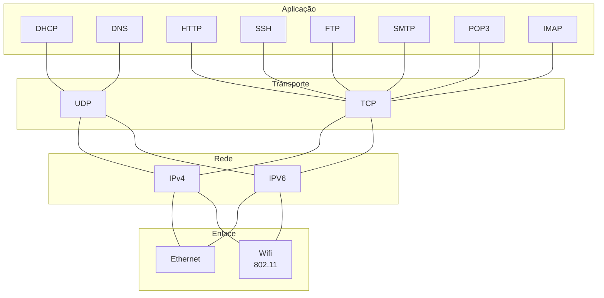

# Gráfico de Ampulheta para TCP/IP

```mermaid
graph BT

    ethernet[Ethernet]
    wifi[Wifi<br>802.11]

    ipv4[IPv4]
    ipv6[IPV6]
    
    tcp[TCP]
    udp[UDP]

    dhcp[DHCP]
    dns[DNS]

    http[HTTP]
    ssh[SSH]
    ftp[FTP]
    smtp[SMTP]
    pop3[POP3]
    imap[IMAP]
    
    ethernet & wifi --- ipv4 & ipv6
    ipv4 & ipv6 --- tcp & udp
    udp --- dhcp & dns
    tcp --- http & ssh & ftp & smtp & pop3 & imap
    
    subgraph Enlace
        ethernet
        wifi
    end
    
    subgraph Rede
        ipv4
        ipv6
    end
    
    subgraph Transporte
        tcp
        udp
    end
    
    subgraph Aplicação
        dhcp
        dns

        http
        ssh
        ftp
        smtp
        pop3
        imap
    end
```